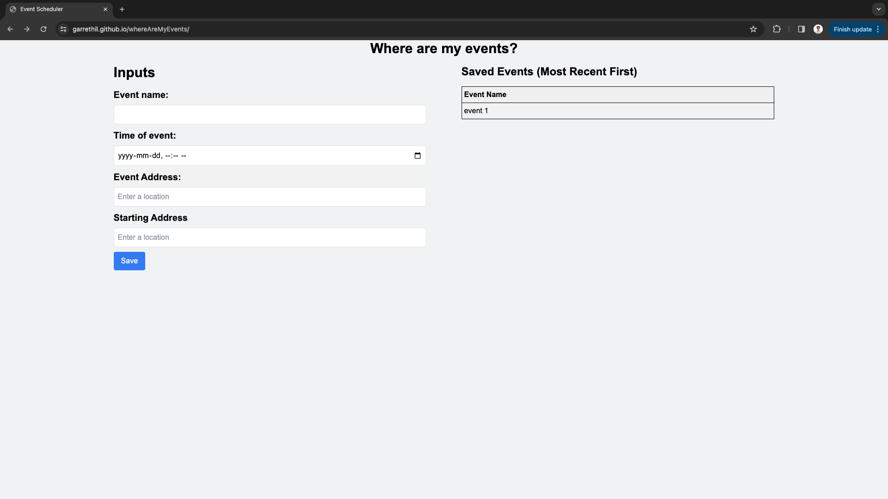
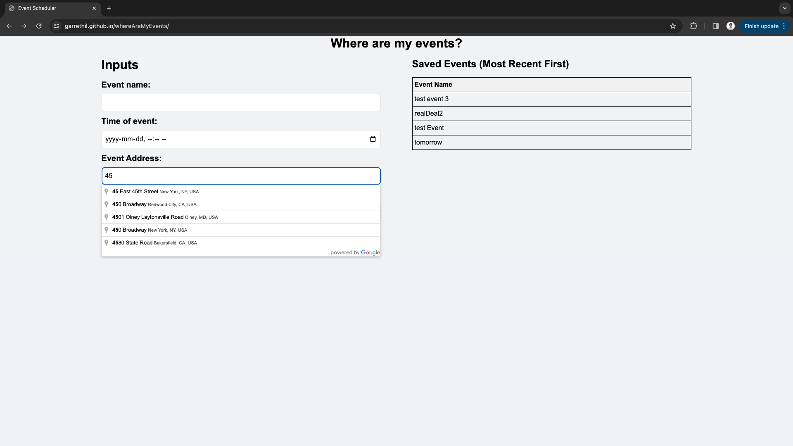
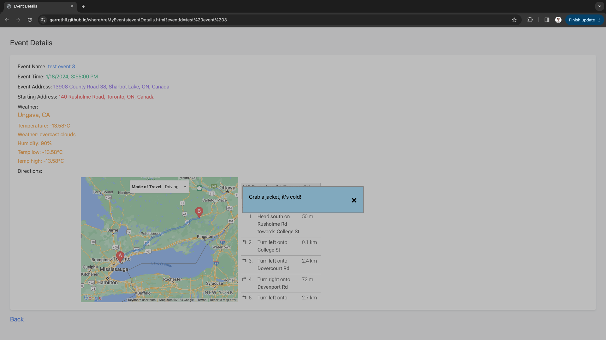
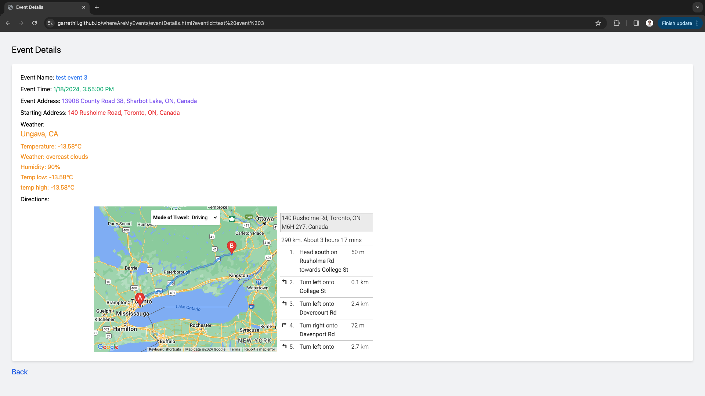

# Where are my events?

## description
For users to store future events with detail information including event name, time, location. Once an event is selected, the application will respond with not only the stored information, but also the weather information of the event date and the navigation to the event address.

## technologies used
html
Tailwind css
JavaScript
Openweathermap API
Google Maps API

## screenshot

## Credits

Contributers from:
https://github.com/Joyce77777777
https://github.com/bahman927
https://github.com/garrethil 

## link
https://garrethil.github.io/whereAreMyEvents/